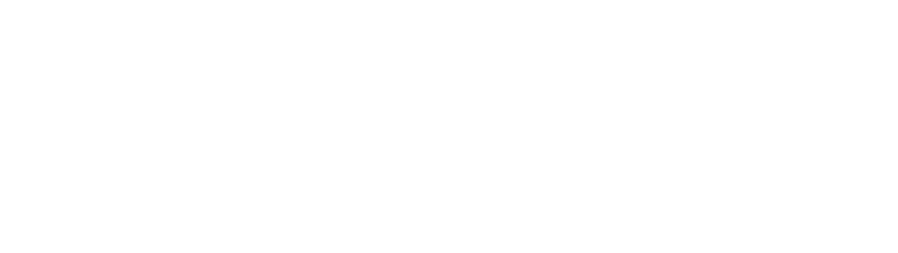

# Aghatis

A modern and responsive website showcasing Aghatis' services, portfolio, and expertise. Built with Next.js and Tailwind CSS.



## Features

- **Dynamic Navbar**: Changes colors based on background section
- **Responsive Design**: Fully responsive layout for all devices
- **Modern UI**: Clean and professional interface
- **Interactive Elements**: Smooth scrolling, hover effects, and transitions
- **Performance Optimized**: Fast loading and rendering

## Tech Stack

- **Framework**: Next.js 15.3.3
- **Language**: TypeScript
- **Styling**: Tailwind CSS 4
- **State Management**: React Hooks
- **Images**: Next.js Image Component
- **Linting**: ESLint with Next.js configuration

## Project Structure

```
aghatis/
├── public/           # Static files
│   └── app/img/      # Images including logos
├── src/
│   └── app/
│       ├── components/  # React components
│       │   ├── contact.tsx
│       │   ├── footer.tsx
│       │   ├── hero.tsx
│       │   ├── navbar.tsx
│       │   ├── portfolio.tsx
│       │   ├── running-text.tsx
│       │   ├── service.tsx
│       │   ├── testimonials.tsx
│       │   └── trusted.tsx
│       ├── img/         # Image assets
│       ├── globals.css  # Global styles
│       ├── layout.tsx   # Root layout
│       └── page.tsx     # Main page
├── next.config.ts    # Next.js configuration
├── postcss.config.mjs # PostCSS configuration
└── tailwind.config.ts # Tailwind configuration
```

## Getting Started

1. Clone the repository:

```bash
git clone https://gitlab.aghatis.id/aghatis/new-aghatis.git
cd aghatis
```

2. Install the dependencies:

```bash
npm install
```

3. Run the development server:

```bash
npm run dev
```

Open [http://localhost:3000](http://localhost:3000) with your browser to see the result.

## Available Scripts

- `npm run dev` - Runs the development server
- `npm run build` - Builds the application for production
- `npm run start` - Starts the production server
- `npm run lint` - Runs ESLint to check code quality

## Key Components

- **Navbar**: Dynamic navigation bar that changes appearance based on scroll position
- **Hero**: Main landing section with call-to-action
- **Services**: Showcase of company services
- **Portfolio**: Display of previous work and projects
- **Testimonials**: Client feedback and reviews
- **Contact**: Contact form and information

## Deployment

The site can be deployed using any platform that supports Next.js applications, such as Vercel, Netlify, or traditional hosting with a Node.js server.

## License

All rights reserved by Aghatis.
